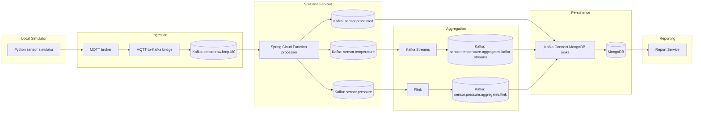

# IoT Event Processing

A local IoT event-processing pipeline for sensor data. The system ingests BMP180 measurements over MQTT, converts them into Avro-backed Kafka events, runs multiple event processor demos, persists selected streams to MongoDB, and renders aggregate reports in a small Spring MVC UI.

The repository is intentionally structured as a Gradle monorepo so the same sensor event contract can be reused across ingestion, stream processing, persistence, and reporting.

## Event Processor Demos

This project demonstrates three different event-processing styles on the same Kafka-based data flow:

- `event-processor-spring-cloud-function`: normalizes enriched sensor events and fans them out into processed, temperature, and pressure streams.
- `event-processor-kafka-streams`: consumes the temperature stream and computes windowed temperature aggregates.
- `event-processor-flink`: consumes the pressure stream and computes pressure aggregates including delta and trend.

## Avro Event Contract

The `common-events` module contains the shared domain event records and Avro schemas used by the pipeline. The MQTT bridge serializes Avro events to Kafka through Confluent Schema Registry, and the downstream processors consume or publish those typed event shapes instead of ad hoc JSON.

Important event types include:

- `SensorEvent`
- `EnrichedSensorEvent`
- `ProcessedSensorEvent`
- `TemperatureEvent`
- `PressureEvent`
- `TemperatureAggregateEvent`
- `PressureAggregateEvent`

## What This Project Contains

- Mosquitto MQTT broker for local sensor ingestion
- Raspberry Pi BMP180 publisher and local simulator under `sensordata/`
- Spring Boot MQTT-to-Kafka bridge
- Shared `common-events` module for domain events, Avro schemas, and Avro mapping helpers
- Spring Cloud Function event processor demo for normalization and fan-out
- Kafka Streams event processor demo for temperature window aggregations
- Flink event processor demo for pressure window aggregations
- Kafka Connect MongoDB sinks for normalized events and aggregates
- Spring MVC report service for rendering aggregate data from MongoDB
- Docker Compose stack for the complete local setup

## Repository Layout

```text
.
├── common-events/                         # Shared event records and Avro schemas
├── event-processor-flink/                 # Flink pressure aggregation demo
├── event-processor-kafka-streams/         # Kafka Streams temperature aggregation demo
├── event-processor-spring-cloud-function/ # Spring Cloud Function fan-out demo
├── kafka-connect/                         # Kafka Connect image with MongoDB sink plugin
├── mosquitto/                             # Local MQTT broker config
├── mqtt-to-kafka-bridge/                  # MQTT ingestion bridge to Kafka/Avro
├── report-service/                        # Spring MVC aggregate report UI
├── sensordata/                            # Raspberry Pi BMP180 publisher and simulator
└── docker-compose.yml
```

## Architecture



## Event Split

The Spring Cloud Function processor consumes the enriched sensor event stream and publishes three downstream event types:

- `ProcessedSensorEvent` for MongoDB persistence
- `TemperatureEvent` for Kafka Streams aggregation
- `PressureEvent` for Flink aggregation

This keeps the normalization logic centralized and lets the downstream processors focus on stream-specific work.

## Data Flow

1. The local simulator publishes MQTT sensor payloads to the broker.
2. The bridge subscribes to MQTT, validates the payloads, enriches them, and writes Avro events to Kafka.
3. The Spring Cloud Function processor splits the stream into a processed record and two measurement-specific streams.
4. Kafka Streams consumes the temperature stream and publishes windowed aggregates.
5. Flink consumes the pressure stream and publishes pressure aggregates.
6. Kafka Connect persists the processed stream and both aggregate streams into separate MongoDB collections.
7. The report service reads the aggregate collections from MongoDB and renders a small web UI. JSON endpoints remain available for checks and automation.

## Module Overview

### `common-events`
Shared domain model, Avro schemas, and Avro conversion helpers used by the bridge and processors.

### `mqtt-to-kafka-bridge`
Spring Boot service that subscribes to MQTT, queues incoming payloads, validates and enriches them, then publishes Avro events to Kafka.

### `event-processor-spring-cloud-function`
Consumes the enriched sensor stream and fans out the data into the processed, temperature, and pressure topics.

### `event-processor-kafka-streams`
Consumes `sensor.temperature` and computes temperature window aggregates.

### `event-processor-flink`
Consumes `sensor.pressure` and computes pressure window aggregates.

### `report-service`
Spring MVC service that reads `iot.temperature_aggregates` and `iot.pressure_aggregates` from MongoDB and renders the generated aggregate data as a small web UI. JSON endpoints remain available under `/api/reports` for checks and automation.

## Local Services

The Docker Compose stack starts the following services:

- `mosquitto` on `1883`
- `kafka` on `9092`
- `schema-registry` on `8081`
- `kafka-connect` on `8083`
- `mongodb` on `27017`
- `mqtt-to-kafka-bridge`
- `report-service` on `8080`
- `event-processor-spring-cloud-function`
- `event-processor-kafka-streams`
- `event-processor-flink`

## Kafka Topics

- `sensor.raw.bmp180`
- `sensor.processed`
- `sensor.temperature`
- `sensor.pressure`
- `sensor.temperature.aggregates.kafka-streams`
- `sensor.pressure.aggregates.flink`
- `sensor.raw.invalid`
- `sensor.raw.retry`

## MongoDB Collections

- `sensor.processed` -> `iot.sensor_measurements`
- `sensor.temperature.aggregates.kafka-streams` -> `iot.temperature_aggregates`
- `sensor.pressure.aggregates.flink` -> `iot.pressure_aggregates`

## Requirements

- Java 21
- Docker and Docker Compose
- Python 3.12+ for the local sensor simulator

## Build

```bash
./gradlew build
```

## Run The Stack

Start the infrastructure and services:

```bash
docker compose up -d --build
```

Useful checks:

```bash
docker compose ps
curl -fsS http://localhost:8083/connectors
curl -fsS http://localhost:8083/connectors/mongodb-sink-sensor-processed/status
curl -fsS http://localhost:8080/
```


## Report UI

The report service renders the aggregate data that Kafka Connect writes to MongoDB.

Open the web UI:

```text
http://localhost:8080/
```

The page shows compact temperature and pressure summaries plus the latest aggregate windows. The `limit` query parameter controls the number of rows and is clamped to `1..200`:

```text
http://localhost:8080/?limit=50
```

JSON endpoints remain available for checks and automation:

```bash
curl -fsS http://localhost:8080/api/reports
curl -fsS 'http://localhost:8080/api/reports/temperature?limit=20'
curl -fsS 'http://localhost:8080/api/reports/pressure?limit=20'
```

For local development outside Docker, the report service defaults to MongoDB on `localhost:27017` with username `admin`, password `admin`, database `iot`, and authentication database `admin`. The Spring Boot 4 configuration uses `spring.mongodb.uri`; the URI parts can be overridden with `MONGODB_HOST`, `MONGODB_PORT`, `MONGODB_DATABASE`, `MONGODB_USERNAME`, `MONGODB_PASSWORD`, and `MONGODB_AUTHENTICATION_DATABASE`.

## Sensor Publishers

The `sensordata/testdata` folder contains a local MQTT simulator. It publishes the same JSON structure that the Raspberry Pi publisher uses:

```json
{
  "deviceId": "raspberrypi",
  "sensor": "BMP180",
  "temperatureC": 22.5,
  "pressureHpa": 1012.0,
  "timestamp": "2026-06-07T12:00:00+00:00"
}
```

Run the local simulator:

```bash
cd sensordata/testdata
./setup.sh
MQTT_BROKER=localhost MQTT_PORT=1883 MQTT_TOPIC=sensors/raspberrypi/bmp180 ./run.sh
```

For the Raspberry Pi with a BMP180 attached over I2C, use `sensordata/bmp180_mqtt.py`. It reads the real sensor, computes compensated temperature and pressure values, and publishes the same event shape.

Install dependencies on the Raspberry Pi:

```bash
cd sensordata
python3 -m venv .venv
. .venv/bin/activate
pip install -r requirements.txt
```

Run the Raspberry Pi publisher. Use the LAN IP or host name of the machine running Mosquitto, not `localhost` unless Mosquitto runs on the Pi itself:

```bash
MQTT_BROKER=192.168.178.31 MQTT_PORT=1883 MQTT_TOPIC=sensors/raspberrypi/bmp180 python bmp180_mqtt.py
```

A `tcp://` or `mqtt://` prefix is accepted as well:

```bash
MQTT_BROKER=tcp://192.168.178.31:1883 python bmp180_mqtt.py
```

Supported environment variables for both publishers are `MQTT_BROKER`, `MQTT_PORT`, `MQTT_TOPIC`, `DEVICE_ID`, `SENSOR`, and `INTERVAL_SECONDS`. The BMP180 publisher additionally supports `BMP180_BUS`, `BMP180_ADDR`, `BMP180_OVERSAMPLING`, and `MQTT_CONNECT_RETRY_SECONDS`.

## Notes

- The simulator defaults to `localhost`, so no Raspberry Pi is required.
- The stream processor modules use `installDist` artifacts in their Dockerfiles to keep the container builds simple and reproducible. The report service uses a Spring Boot executable jar.
- Aggregate topics and collections are intentionally separate so each event shape stays isolated in MongoDB.
